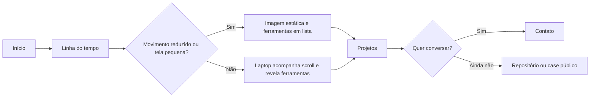

# UX — Portfólio · Projeto

> 07/10/2026 · Fontes: portfólio atual, dossiê auditado em `E:\04-dev\docs_for_portfolio`, seleção visual em `img`, briefing do proprietário. Wireframe navegável: `ux-portfolio-wireframe.html`.

## 1. Público e tarefas-chave

| Visitante | Precisa entender | Ação de sucesso |
|---|---|---|
| Recrutador ou gestor técnico | Evolução da engenharia para software e AppSec, com profundidade verificável | Abrir um case ou entrar em contato |
| Par técnico | Que problema foi trabalhado, quais ferramentas foram usadas e o limite da evidência | Explorar projetos e repositórios públicos |
| Visitante em celular | A história em blocos curtos, mesmo sem animação pesada | Percorrer até os projetos e contato sem perder orientação |

## 2. Jornada prioritária

1. O topo apresenta o fio condutor: construir, entender, proteger.
2. A linha do tempo alterna bloco curto de texto e imagem contextual. O texto revela uma ideia por vez; não depende da animação para ser lido.
3. A passagem para Cyber mostra o laptop da sequência fornecida. A interface Kali é uma representação narrativa do laboratório, não uma alegação de execução de cada ferramenta do sistema operacional.
4. O visitante explora ferramentas comprovadas no laboratório local e segue para os projetos.
5. Cada projeto informa contexto, trabalho e evidência pública possível. O contato encerra a jornada com email e formulário.

## 3. Arquitetura de informação

`Início → Trajetória → Laboratório Cyber → Projetos → Competências → Contato`

Navegação fixa com âncoras para Trajetória, Laboratório, Projetos e Contato. A seção Cyber fica entre a história e o catálogo de projetos, como virada de assunto. Evitar um menu com todas as subseções da versão antiga, pois a página é uma narrativa contínua.

## 4. Fluxo principal



## 5. Wireframes anotados

```text
┌────────────────────────── topo ──────────────────────────┐
│ nome                    trajetória  laboratório  projetos │  1
├───────────────────────────────────────────────────────────┤
│ CONSTRUIR, ENTENDER, PROTEGER.                            │  2
│ uma frase de apresentação                   ver projetos  │
├───────────────────────────────────────────────────────────┤
│ 2019  Iniciativa              [espaço editorial]          │
│ 2022  Engenharia             [foto de bancada]           │  3
│ 2024  Fórmula SAE            [foto de pista]             │
│ 2026  AppSec                [texto, sem foto corporativa] │
├───────────────────────────────────────────────────────────┤
│               [laptop / representação Kali]              │  4
│               ferramentas comprovadas                    │
├───────────────────────────────────────────────────────────┤
│ [case engenharia] [case software] [case segurança]        │  5
├───────────────────────────────────────────────────────────┤
│ competências por domínio                contato           │  6
└───────────────────────────────────────────────────────────┘
```

1. Navegação curta, sempre com foco visível e âncora direta.
2. Identidade profissional em uma frase. CTA para projeto e contato acessíveis já no primeiro painel.
3. Um título, uma frase e um detalhe por capítulo; fotos ilustram momentos confirmados, sem inferir trabalho pela imagem.
4. A cena não deve capturar o scroll nem impedir navegação por teclado. Em movimento reduzido, mostrar conteúdo equivalente em lista.
5. Cada card deve expor link só quando há destino real. Não criar “Demo” vazio.
6. Competências agrupadas por domínio; contato com feedback de envio, erro e alternativa por email.

## 6. Estados e microcopy

| Estado | Texto |
|---|---|
| Pista de scroll | “Explore a trajetória” |
| Cena Cyber | “Continue rolando para explorar as ferramentas usadas no laboratório.” |
| Movimento reduzido | “Explore as ferramentas usadas no laboratório.” |
| Enviando formulário | “Enviando…” |
| Formulário enviado | “Mensagem enviada. Obrigado pelo contato!” |
| Erro de envio | “Não foi possível enviar agora. Tente novamente ou escreva diretamente por e-mail.” |
| Case sem link público | Nenhum botão; descrição ainda útil e completa. |

## 7. Decisões e limites

- A progressão visual apoia a leitura, mas o texto permanece no DOM e legível sem animação: acessibilidade e controle do usuário.
- Datas de Fórmula SAE e LifeStyles vêm da narrativa já publicada no site; a redação não acrescenta resultados ou métricas não comprovados.
- Case corporativo usa nome genérico e não traz foto de ambiente, dados internos, achados ou relatório confidencial.
- A home Kali lista Python, Flask, Selenium, Firefox, Bash e Kali Linux apenas no contexto do laboratório. CodeQL, Trivy e Gitleaks aparecem como trabalho de CI; Syft, Cosign, OSV e ZAP ficam fora da lista de prática implantada.
- Fotos selecionadas para a web precisam ter orientação corrigida e EXIF/GPS removidos antes da publicação.

## 8. Handoff para frontend-specialist

- Conteúdo tipado em `lib/portfolio-content.ts`.
- Implementar sequência `hero → timeline → cyber → projects → skills → contact` com âncoras estáveis.
- Usar `image` como URL tratada, `imageAlt` como texto alternativo; `imageCandidate` é apenas referência editorial.
- Respeitar `prefers-reduced-motion`, teclado, foco visível e apresentação estática equivalente.
- Mostrar links só quando `href` existir. O formulário precisa estado de envio, sucesso, erro e email alternativo.
